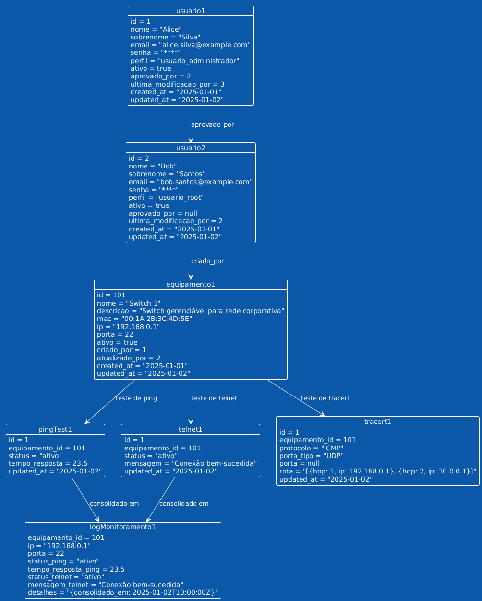

# Monitor EQP - Sistema de Monitoramento de Equipamentos

## Descrição
    Este projeto é um sistema para monitoramento de equipamentos, incluindo gerenciamento de usuários, solicitações de acesso e logs de monitoramento. Ele também oferece ferramentas de teste de conectividade (Ping, Telnet, Tracert) para avaliar o desempenho dos dispositivos.

## Tecnologias
*   **Node.js (Express)**: Framework para criação do servidor e APIs RESTful.
*   **MySQL**: Banco de dados relacional para armazenamento de dados.
*   **JWT**: Implementação de autenticação segura.
*   **Ferramentas de Monitoramento**: Ping, Telnet e Tracert para teste de conectividade e diagnóstico.

## Estrutura do Banco de Dados
*   **usuarios**: Gerencia informações dos usuários, como nome, email, senha e perfil de acesso.
*   **equipamentos**: Registra os dispositivos monitorados, incluindo IP, hostname e status.
*   **solicitacoes_acesso**: Armazena solicitações de novos acessos, aguardando aprovação.
*   **sessoes**: Monitora as sessões ativas de usuários autenticados.
*   **pingtest**: Armazena os resultados de testes de conectividade via Ping.
*   **telnet**: Registra os logs de conexões realizadas com Telnet.
*   **tracert**: Contém os dados de rastreamento de rota (Tracert).
*   **logs_monitoramento**: Centraliza os logs de monitoramento para auditoria.

> ### Diagrama do Banco de Dados
> **Diagrama Entidade-Relacionamento (DER)**
>
>Este diagrama representa a estrutura do banco de dados utilizado no projeto.
>
>
> Você pode visualizar o diagrama interativo do banco de dados aqui:
> [Diagrama do Banco de Dados no dbdocs.io](https://dbdocs.io/freires.carlos/Monitor-EQP-Sistema-de-Monitoramento-de-Equipamentos?view=table_structure)


## Configuração
1.  Instale as dependências do projeto:
    ```bash
    npm install
    ```

2.  Configure as variáveis de ambiente no arquivo .env:
    ```SERVER_PORT=2200
    DB_HOST = seu_host
    DB_USER = seu_usuario
    DB_PASSWORD = sua_senha
    DB_NAME = monitor_eqp
    JWT_SECRET = sua_chave_secreta
    ```

3.  Execute o script de criação do banco de dados:
    ```bash
    mysql -u <usuario> -p < schema.sql
    ```

4. Inicie o servidor:
    ```bash
    npm start
    ```

## Funcionalidades
### Gerenciamento de Usuários
*   Autenticação e autorização via JWT.
*   Cadastro e edição de usuários.
*   Aprovação e rejeição de solicitações de acesso.
*   Ativação e inativação de usuários.
### Monitoramento de Equipamentos
*   Cadastro, atualização, exclusão e listagem de equipamentos.
*   Testes de conectividade com Ping, Telnet e Tracert.
*   Logs detalhados de cada teste e evento.
### Auditoria e Logs
*   Registro detalhado das operações de monitoramento.
*   Armazenamento de resultados para consulta futura.
### Estrutura do Projeto
*   app.js: Arquivo principal que inicializa o servidor e configura middlewares e rotas.
*   database/conectadb.js: Configuração da conexão com o banco de dados.
*   middleware: Contém middlewares para CORS, autenticação e tratamento de erros.
*   routes-services: Organização modular de rotas públicas e protegidas.

> ### Diagramas UML
> **Diagrama de classes**
>
>Este diagrama representa a estrutura de classes do sistema.
>

> **Diagrama de objetos**
>
>Este diagrama representa a estrutura de classes do sistema.
>


### Rotas
**Públicas**

*   `POST /login`: Autentica um usuário e retorna um token JWT.
*   `POST /solicitarAcesso`: Permite que novos usuários solicitem acesso ao sistema.

**Protegidas (Requerem Autenticação)**

### Usuários

*   `POST /cadastrarUsuario`: Cadastra um novo usuário (administrador ou root).
*   `PUT /atualizar-senha`: Atualiza a senha do usuário autenticado.
*   `GET /dados-cadastrais`: Recupera os dados do usuário autenticado.

### Equipamentos

*   `POST /cadastrarEquipamento`: Adiciona um novo equipamento ao sistema.
*   `PUT /atualizarEquipamento`: Atualiza informações de um equipamento existente.
*   `DELETE /deletarEquipamento`: Remove um equipamento do sistema.
*   `GET /listarEquipamentos`: Lista todos os equipamentos cadastrados.

### Licença
**Este projeto é licenciado sob a MIT License.**